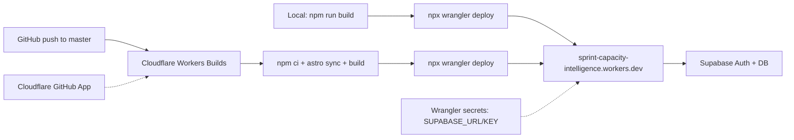

# First Cloudflare Workers Deployment Plan

Bring the Astro 6 + React + Supabase app live on Cloudflare Workers using the already-wired `@astrojs/cloudflare` adapter, then wire **Cloudflare Workers Builds** (GitHub integration) for automatic deploy on push to `master`. Aligns with the recommendation in [context/foundation/infrastructure.md](../../foundation/infrastructure.md) (Workers Static Assets, not legacy Pages) and the hand-off in [context/foundation/tech-stack.md](../../foundation/tech-stack.md).

## Todos

- [ ] **supabase-provision** — Provision hosted Supabase project (region-matched), capture URL + anon key → copy to `.env` + `.dev.vars` via `.env.example`
- [x] **config-align** — Renamed worker in `wrangler.jsonc`; pinned SESSION KV; added `.env.example` (create `.dev.vars` after Supabase)
- [x] **wrangler-auth-secrets** — `wrangler login` verified (`marcelina.kucieba@olx.pl`); `SUPABASE_*` secrets pending hosted Supabase
- [x] **first-deploy** — Deployed to https://sprint-capacity-intelligence.marcelina-kucieba.workers.dev
- [x] **smoke-test** — `/` 200, `/auth/signin` 200, `/dashboard` 302 → `/auth/signin`; version `4f436e64-eb0f-4aa1-bcf2-a32c8caec1c1`
- [ ] **cf-workers-builds** — Connect GitHub repo to the Worker via Cloudflare Workers Builds; configure build + deploy commands and production branch
- [ ] **verify-cf-auto-deploy** — Push a trivial commit to `master` and verify Cloudflare Builds deploys successfully; re-run smoke tests

## Pre-flight assumptions

- Cloudflare account exists (free tier is fine for MVP per infra doc).
- Code will live in a **GitHub** repository connected to Cloudflare via the [Workers & Pages GitHub App](https://developers.cloudflare.com/workers/ci-cd/builds/git-integration/github-integration/).
- **No GitHub Actions deploy job** — the existing [.github/workflows/ci.yml](../../../.github/workflows/ci.yml) stays lint+build only (optional quality gate); production deploy is handled entirely by Cloudflare Workers Builds.

## Phase 1 — Provision hosted Supabase

1. Create a new Supabase project in the region matching primary users (single-region MVP per infra Risk Register row "Supabase cross-region latency"). Capture `Project URL` and `anon public` key.
2. Confirm **Email** provider is enabled in Supabase Auth (the starter uses email/password via `signInWithPassword` in [src/pages/api/auth/signin.ts](../../../src/pages/api/auth/signin.ts) — no Google OAuth setup needed for this deploy).
3. No SQL migrations to apply — `supabase/migrations/` does not exist yet, and middleware in [src/middleware.ts](../../../src/middleware.ts) only calls `supabase.auth.getUser()`.

## Phase 2 — Align local config

Two small config edits before first deploy:

- In [wrangler.jsonc](../../../wrangler.jsonc), rename `"name": "10x-astro-starter"` to `"name": "sprint-capacity-intelligence"` so the default `*.workers.dev` hostname matches the project **and** the Worker name in the Cloudflare dashboard (required for Workers Builds — a name mismatch fails the build). Leave `compatibility_date`, `compatibility_flags: ["nodejs_compat"]`, `assets`, and `observability` untouched.

```1:15:wrangler.jsonc
{
  "$schema": "node_modules/wrangler/config-schema.json",
  "name": "10x-astro-starter",
  "main": "@astrojs/cloudflare/entrypoints/server",
  "compatibility_date": "2026-05-08",
  "compatibility_flags": ["nodejs_compat"],
  "assets": {
    "binding": "ASSETS",
    "directory": "./dist",
    "not_found_handling": "404-page",
  },
  "observability": {
    "enabled": true,
  },
}
```

- Create local `.dev.vars` from `.env.example` with real Supabase values for local Workers dev (`npm run dev`):
  ```bash
  cp .env.example .dev.vars
  # fill SUPABASE_URL and SUPABASE_KEY from hosted Supabase project
  ```

## Phase 3 — Authenticate Wrangler and set production secrets

1. One-time: `npx wrangler login` — opens browser, authorizes the account.
2. Confirm: `npx wrangler whoami` — sanity-check account email / ID.
3. Push production secrets (interactive prompts, paste values from Phase 1):
   - `npx wrangler secret put SUPABASE_URL`
   - `npx wrangler secret put SUPABASE_KEY`

These map to the `astro:env/server` declarations in [astro.config.mjs](../../../astro.config.mjs) and are consumed by `createClient` in `src/lib/supabase.ts`. They are runtime-only — not needed at build time because both fields are `optional: true` in the env schema. Workers Builds reuses these Wrangler secrets at deploy time; do **not** put them in the repo or GitHub secrets.

## Phase 4 — Manual first deploy

1. `npm run build` — produces `./dist` (matches `assets.directory` in `wrangler.jsonc`).
2. `npx wrangler deploy` — uploads Worker + assets. **Do NOT use `npx wrangler pages deploy`** (explicitly banned by infra Risk Register row "Wrong deploy command").
3. Capture the printed `*.workers.dev` URL for smoke tests in Phase 5.

This manual deploy validates the stack before wiring auto-deploy. It also registers the Worker in the Cloudflare dashboard so Phase 6 can connect the GitHub repo to an existing Worker (name must match `wrangler.jsonc`).

## Phase 5 — Smoke test

Against the new `*.workers.dev` URL:

- `GET /` — landing page renders (200, no Supabase client needed).
- `GET /auth/signin` — signin page renders (form submit not required for first deploy).
- `GET /dashboard` — should 302 to `/auth/signin` (middleware in [src/middleware.ts](../../../src/middleware.ts) protects this route).
- Optional: create a test user in Supabase and verify email/password sign-in end-to-end.
- `npx wrangler tail` in another terminal during the test — confirm no `SUPABASE_URL` undefined errors and no `nodejs_compat` missing-module warnings.
- `npx wrangler deployments list` — confirm the new deployment is current; record `VERSION_ID` for emergency rollback per infra Operational Story.

## Phase 6 — Cloudflare Workers Builds (GitHub auto-deploy)

Connect the GitHub repository to the Worker created in Phase 4. Cloudflare monitors the repo and runs build + deploy on every push — no GitHub Actions deploy job needed.

### 6a — Push repo to GitHub

1. Create a GitHub repository for `sprint-capacity-intelligence`.
2. Push local `master` branch: `git remote add origin <github-url>` → `git push -u origin master`.
3. Ensure `wrangler.jsonc` rename from Phase 2 is committed before connecting Builds.

### 6b — Connect repo in Cloudflare dashboard

1. Go to **Workers & Pages** → select the `sprint-capacity-intelligence` Worker.
2. Open **Settings** → **Builds** → **Connect**.
3. Install/authorize the **Cloudflare Workers and Pages** GitHub App for the target org/account.
4. Select the GitHub repository and production branch (`master`).

### 6c — Configure build settings

| Setting               | Value                                       | Notes                                                              |
| --------------------- | ------------------------------------------- | ------------------------------------------------------------------ |
| Root directory        | `/` (repo root)                             | `wrangler.jsonc` lives at root                                     |
| Build command         | `npm ci && npx astro sync && npm run build` | Mirrors existing CI; produces `./dist`                             |
| Deploy command        | `npx wrangler deploy`                       | Default; uses `wrangler.jsonc` — **not** `wrangler pages deploy`   |
| Production branch     | `master`                                    | Matches existing `.github/workflows/ci.yml`                        |
| Non-production deploy | `npx wrangler versions upload` (default)    | Preview versions on other branches without promoting to production |

No `SUPABASE_URL` / `SUPABASE_KEY` in build env — Wrangler secrets from Phase 3 are the runtime source of truth.

### 6d — Verify auto-deploy

1. Push a trivial commit to `master`.
2. Watch the build in Cloudflare dashboard (**Workers & Pages** → Worker → **Deployments** / **Builds**).
3. Confirm GitHub commit status shows build result (Cloudflare posts status back to GitHub).
4. Re-run smoke tests from Phase 5 against the live URL.
5. Optionally push a commit to a non-`master` branch and confirm a preview version is created without replacing production.

## Deploy flow at a glance



## Explicitly out of scope for this first deploy

- **Google OAuth provider** — deferred; starter auth is email/password only for now.
- **GitHub Actions deploy job** — deferred; existing CI workflow stays lint+build only.
- Custom domain / DNS — defer until after smoke tests pass.
- Cloudflare Access on preview URLs (infra Risk Register row "Preview URL leaks sprint data") — consider before sharing preview URLs with real sprint data.
- Hyperdrive / `pg` direct Postgres path (infra Devil's Advocate point 2) — only needed if Worker CPU limits bite under sprint aggregation load, which isn't built yet.
- Supabase SQL migrations and RLS — no migrations exist yet.

## Rollback note

If a deploy misbehaves: `npx wrangler deployments list` → `npx wrangler rollback [VERSION_ID]`. Supabase state is not rolled back by Worker rollback (per infra Operational Story). For Builds-triggered deploys, rollback via Wrangler or promote a previous version in the Cloudflare dashboard.
