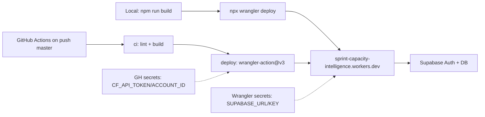

# First Cloudflare Workers Deployment Plan

Bring the Astro 6 + React + Supabase app live on Cloudflare Workers using the already-wired `@astrojs/cloudflare` adapter, then automate the deploy on master via GitHub Actions. Aligns with the recommendation in [context/foundation/infrastructure.md](../foundation/infrastructure.md) (Workers Static Assets, not legacy Pages) and the hand-off in [context/foundation/tech-stack.md](../foundation/tech-stack.md).

## Todos

- [ ] **supabase-provision** — Provision hosted Supabase project (region-matched), capture URL + anon key, configure Google OAuth provider
- [ ] **config-align** — Rename worker in `wrangler.jsonc` to `sprint-capacity-intelligence` and create local `.dev.vars`
- [ ] **wrangler-auth-secrets** — `wrangler login` + `whoami`, then `wrangler secret put SUPABASE_URL` / `SUPABASE_KEY`
- [ ] **first-deploy** — `npm run build && npx wrangler deploy`; capture `*.workers.dev` URL; back-fill Supabase OAuth redirect
- [ ] **smoke-test** — Smoke test `/`, `/auth/signin`, `/dashboard` redirect; tail logs; record deployment `VERSION_ID`
- [ ] **gh-actions-deploy** — Extend `.github/workflows/ci.yml` with deploy job using `cloudflare/wrangler-action@v3` on push to master; add `CLOUDFLARE_API_TOKEN` + `CLOUDFLARE_ACCOUNT_ID` repo secrets
- [ ] **verify-ci-deploy** — Push trivial commit to master and verify auto-deploy job succeeds + re-run smoke tests

## Pre-flight assumptions

- Cloudflare account exists (free tier is fine for MVP per infra doc).
- GitHub repo will be the source for the GH Actions deploy job; remote not yet set locally (`git remote -v` is empty).
- We are intentionally NOT switching to GitLab CI right now; that's tracked as a follow-up against the tech-stack hand-off.

## Phase 1 — Provision hosted Supabase

1. Create a new Supabase project in the region matching primary users (single-region MVP per infra Risk Register row "Supabase cross-region latency"). Capture `Project URL` and `anon public` key.
2. Verify Auth providers expected by the app (`/auth/signin`, `/auth/signup` in [src/pages/auth/](../../src/pages/auth)) are enabled; configure Google OAuth provider in Supabase dashboard with redirect URL set to the future Worker URL (placeholder for now; we'll update after Phase 4 returns the actual hostname).
3. No SQL migrations to apply — `supabase/migrations/` does not exist yet, and middleware in [src/middleware.ts](../../src/middleware.ts) only calls `supabase.auth.getUser()`.

## Phase 2 — Align local config

Two small config edits before first deploy:

- In [wrangler.jsonc](../../wrangler.jsonc), rename `"name": "10x-astro-starter"` to `"name": "sprint-capacity-intelligence"` so the default `*.workers.dev` hostname matches the project. Leave `compatibility_date`, `compatibility_flags: ["nodejs_compat"]`, `assets`, and `observability` untouched.

```1:15:wrangler.jsonc
{
  "$schema": "node_modules/wrangler/config-schema.json",
  "name": "10x-astro-starter",
  "main": "@astrojs/cloudflare/entrypoints/server",
  "compatibility_date": "2026-05-08",
  "compatibility_flags": ["nodejs_compat"],
  "assets": {
    "binding": "ASSETS",
    "directory": "./dist",
    "not_found_handling": "404-page",
  },
  "observability": {
    "enabled": true,
  },
}
```

- Create local `.dev.vars` (already gitignored via `.gitignore` `.dev.vars` entry) with real Supabase values for local Workers dev (`npm run dev`). The existing `.env` placeholders can stay as documentation.

## Phase 3 — Authenticate Wrangler and set production secrets

1. One-time: `npx wrangler login` — opens browser, authorizes the account.
2. Confirm: `npx wrangler whoami` — sanity-check account email / ID.
3. Push production secrets (interactive prompts, paste values from Phase 1):
   - `npx wrangler secret put SUPABASE_URL`
   - `npx wrangler secret put SUPABASE_KEY`

These map to the `astro:env/server` declarations in [astro.config.mjs](../../astro.config.mjs) and are consumed by `createClient` in `src/lib/supabase.ts`. They are runtime-only — not needed at build time because both fields are `optional: true` in the env schema.

## Phase 4 — Manual first deploy

1. `npm run build` — produces `./dist` (matches `assets.directory` in `wrangler.jsonc`).
2. `npx wrangler deploy` — uploads Worker + assets. **Do NOT use `npx wrangler pages deploy`** (explicitly banned by infra Risk Register row "Wrong deploy command").
3. Capture the printed `*.workers.dev` URL — needed for Supabase OAuth redirect config and smoke test.
4. Back-fill the Worker URL into Supabase Auth → Google provider Authorized redirect URIs.

## Phase 5 — Smoke test

Against the new `*.workers.dev` URL:

- `GET /` — landing page renders (200, no Supabase client needed).
- `GET /auth/signin` — signin page renders.
- `GET /dashboard` — should 302 to `/auth/signin` (middleware in [src/middleware.ts](../../src/middleware.ts) protects this route).
- `npx wrangler tail` in another terminal during the test — confirm no `SUPABASE_URL` undefined errors and no `nodejs_compat` missing-module warnings.
- `npx wrangler deployments list` — confirm the new deployment is current; record `VERSION_ID` for emergency rollback per infra Operational Story.

## Phase 6 — Extend GitHub Actions with deploy on master

Extend [.github/workflows/ci.yml](../../.github/workflows/ci.yml) (do NOT replace) — keep the existing `ci` job that lint+builds on PR and push; add a second `deploy` job that runs only on push to `master`, depends on `ci`, and uses the official Cloudflare action.

New job sketch (added to the existing file):

```yaml
deploy:
  needs: ci
  if: github.event_name == 'push' && github.ref == 'refs/heads/master'
  runs-on: ubuntu-latest
  steps:
    - uses: actions/checkout@v4
    - uses: actions/setup-node@v4
      with: { node-version: 22, cache: npm }
    - run: npm ci
    - run: npx astro sync
    - run: npm run build
    - uses: cloudflare/wrangler-action@v3
      with:
        apiToken: ${{ secrets.CLOUDFLARE_API_TOKEN }}
        accountId: ${{ secrets.CLOUDFLARE_ACCOUNT_ID }}
        command: deploy
```

Required new GitHub repo secrets:

- `CLOUDFLARE_API_TOKEN` — create in Cloudflare dashboard with the "Edit Cloudflare Workers" template, scoped to this account/zone.
- `CLOUDFLARE_ACCOUNT_ID` — copy from Cloudflare dashboard sidebar.

`SUPABASE_URL` / `SUPABASE_KEY` repo secrets are **not** needed for the deploy job (Wrangler secrets are the source of truth at runtime, and the build accepts `optional: true` env). They remain in the existing `ci` job only because that's how it was scaffolded; can be removed in a follow-up.

After merging the workflow change, verify by pushing a trivial commit to `master` and watching the deploy job in the Actions tab; then re-run smoke tests from Phase 5.

## Deploy flow at a glance



## Explicitly out of scope for this first deploy

- Custom domain / DNS — defer until after smoke tests pass.
- Cloudflare Access on preview URLs (infra Risk Register row "Preview URL leaks sprint data") — no previews configured yet.
- Migration from GitHub Actions to GitLab CI — tracked against the tech-stack hand-off; not required to ship first deploy.
- Hyperdrive / `pg` direct Postgres path (infra Devil's Advocate point 2) — only needed if Worker CPU limits bite under sprint aggregation load, which isn't built yet.
- Supabase SQL migrations and RLS — no migrations exist yet.

## Rollback note

If the first deploy misbehaves: `npx wrangler deployments list` → `npx wrangler rollback [VERSION_ID]`. Supabase state is not rolled back by Worker rollback (per infra Operational Story).
